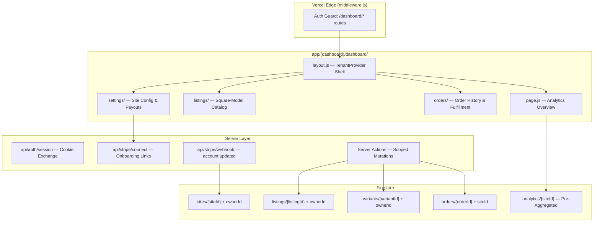

# Phase 6: Website Owner Dashboard

**Project:** CivicOS (Node 1: CentralTexas.com)
**Phase:** 6 — Website Owner Dashboard
**Status:** 🔲 Planning Complete — Ready to Build
**Date:** March 23, 2026

---

## 🎯 Objective

Build the **self-service Website Owner Dashboard** so local business tenants can log in and independently manage their own listings, variants, inventory, orders, sales analytics, and Stripe payouts.

---

## 📐 Architecture Overview

---

## 🔐 Security Model (Three-Layer Enforcement)

### Layer 1: Edge Middleware
Requests to `/dashboard/*` must have a valid session cookie.

### Layer 2: Server Actions & API Routes
Extract `ownerId` from session cookie and validate against target document `ownerId`.

### Layer 3: Firestore Security Rules
Denormalized `ownerId` on every child document enables zero-lookup rules.

---

## 🗓️ Implementation Phases

### Phase 6.1: Security Foundation & Dashboard Shell
1. **Session API:** Exchange Firebase ID token → HTTP-only cookie.
2. **Login Page:** Firebase Auth UI + session setup.
3. **Middleware Guard:** Protect `/dashboard/*`.
4. **Tenant Context:** `TenantProvider` + sidebar shell.
5. **Data Migration:** Run script to denormalize `ownerId` onto existing listings/variants.
6. **Firestore Rules:** Deploy owner-scoped rules.

### Phase 6.2: Catalog & Inventory Engine
7. **Listings Grid:** Scoped fetch by `ownerId`.
8. **Polymorphic Editor:** Services vs. Goods UI.
9. **Atomic Inventory:** Batch-writes for SKUs and `increment()` ops.
10. **MagicBox:** Voice/Camera listing creation in-dashboard.

### Phase 6.3: Stripe Connect & Payouts
11. **Connect API:** Generate Express onboarding links.
12. **Webhook Handler:** Listen for `account.updated`.
13. **Payouts Page:** Connection status & Stripe dashboard link.
14. **Destination Charges:** Split payments (10% platform fee) on checkout.

### Phase 6.4: Orders & Analytics
15. **Order History:** Fulfillment tracking per site.
16. **Pre-Aggregated Analytics:** Cloud Function to sum GMV into `analytics/{siteId}`.
17. **Dashboard Overview:** Snapshots of revenue and top-performing items.
