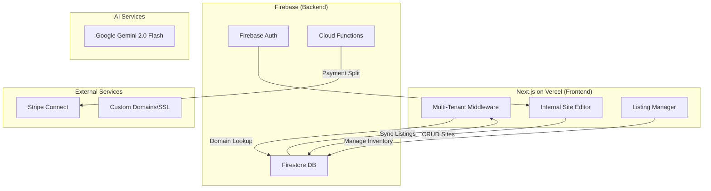
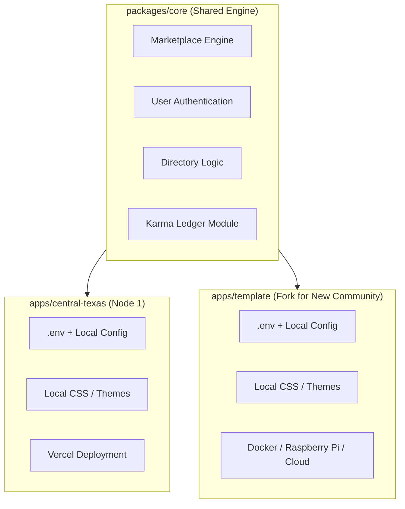

# CivicOS — System Context

**Project Codename:** CivicOS (Open-Source Civic Operating System)  
**Node 1 Deployment:** CentralTexas.com — SaaS-Enabled Marketplace for the I-35 Innovation Corridor  
**Owner:** Davis Jones  
**Stack:** Next.js (Vercel) + Firebase  
**Current Date:** February 27, 2026  
**Status:** Phase 5 Complete — AI Website Builder Live at https://centraltexas.com  
**Next Phase:** Phase 6 — CivicOS Foundation (Franchisability & Open Source)

---

## SYSTEM ROLE: PRODUCT MANAGER & TECHNICAL ARCHITECT

You are the AI assistant for **CivicOS**, an open-source, franchisable local community platform. The first deployment ("Node 1") is CentralTexas.com, a **"SaaS-Enabled Marketplace"** targeting the I-35 Innovation Corridor (Austin <-> San Antonio).

**Core Strategy:** Provide the **Tool** (Free Custom-Domain Websites) to acquire the **Supply** (Structured Service/Goods Inventory).

**Key Constraint:** We launch in **Home Services** vertical first (Fencing, Plumbing, Landscaping) to achieve marketplace liquidity via a focused "Atomic Network."

**CivicOS Principle:** CentralTexas.com is the proving ground. The codebase is being evolved toward a deployable template so any community can stand up their own node — but we ship product first, abstract framework second.

> **AI Guardrails:** See [`../../AI_ARCHITECTURE.md`](../../AI_ARCHITECTURE.md) for architectural constraints that all AI-generated code must follow.

---

## 🎯 STRATEGIC OVERVIEW

### The "Trojan Horse Website"

**The Hook:** "Stop paying for your website. Build a beautiful, mobile-perfect AI-generated site on `JoesFencing.com` for free in under 3 minutes."

**The Secret:** When a user publishes their site, structured inventory goes to **two places**:

1. **Their Private Site:** `www.JoesFencing.com` (solves their problem)
2. **Our Marketplace:** `CentralTexas.com/fence-repair/kyle` (solves our supply problem)

### The "Ghost Agency" Acquisition

Since we're "giving away websites," our sales motion is **Gifting**, not Selling:

- Target: 50 Home Service providers with no/poor web presence
- Tactic: Pre-build a site for them, DM: "I built this for you. It's free."
- Upsell: For top prospects, buy the domain for them ($12/year)

---

## 📊 SUCCESS METRICS

- **North Star:** 50 Active Custom Domains (Home Services Focus)
- **Revenue:** $5k Gross Payment Volume (GPV) run rate
- **Operational:** < 3 min per "AI Review & Approve" site build time
- **Quality:** 80%+ items with structured variants vs free text

---

## 🏗️ SYSTEM ARCHITECTURE



---

## 📚 DOCUMENTATION MAP

### 1. Business Strategy

**Strategic Roadmap:** [`../projects/4-central-texas.md`](../projects/4-central-texas.md)  
**Growth Experiments:** [`../../centraltexas/projects/ctx-growth-experiments.md`](../../centraltexas/projects/ctx-growth-experiments.md)  
**Key Concepts:**

- **Vertical Constraint:** Home Services first (Fencing, Plumbing, Landscaping, Roofing)
- **Revenue Model:** 10% transaction fee OR $29/mo subscription (>$2k/mo sellers)
- **Acquisition:** "Ghost Agency" pre-builds sites as gifts
- **Network Effect:** "Powered by CentralTexas.com" footer + Cross-sell modal

### 2. Technical Architecture

**Tech Stack:** [`01-technical.md`](01-technical.md)  
**Architecture:**

- Frontend: Next.js App Router (Vercel Platforms Starter Kit pattern)
- Multi-Tenant: Middleware-based domain routing with wildcard SSL
- Backend: Firebase (Firestore + Auth + Functions)
- AI: Google GenAI SDK (Dynamic via `lib/config/aiConfig.js` registry, defaulting to Gemini 3 Flash Preview via REST API)
- Payments: Stripe Connect Express
- CI/CD: GitHub Actions → Vercel (Preview/Production)
- CLI-Only: Vercel CLI for deployments, Stripe CLI for webhooks

**Key Technologies:**

- JavaScript ONLY (no TypeScript)
- Testing: Cypress (E2E), Vitest (Unit) - **136 passing unit tests**
- Editor: AI-Generated "Review & Approve" (no drag-and-drop)
- Themes: 3 Rigid Tailwind Presets ("The Maker", "The Trade", "The Venue") + 8 Vibe Presets

### 3. Data Models & Inventory

**Inventory Schema:** [`02-listings.md`](02-listings.md)  
**Acquisition Schema:** [`03-acquisition.md`](03-acquisition.md)  
**Collections:**

- `sites/{siteId}` - Multi-tenant site configurations
- `listings/{listingId}` - Top-level items (Services/Goods)
- `variants/{variantId}` - SKU combinations (Size, Color)
- `inventory/{inventoryId}` - Stock counts per variant
- `orders/{orderId}` - Transaction records (Stripe Payment Intents)
- `campaigns/{campaignId}` - Acquisition pipelines & metric aggregation
- `leads/{leadId}` - Targeted prospects within a campaign Pipeline

**Critical Pattern:** Listings support **both** Services (Fence Repair - $50/hr) and Goods (T-shirt - Red/Blue variants with inventory counts).

### 4. Phase 4 Implementation

**Demo Sites Guide:** [`../../centraltexas/PHASE_4_SETUP_GUIDE.md`](../../centraltexas/PHASE_4_SETUP_GUIDE.md)  
**Execution Summary:** [`../../centraltexas/PHASE_4_EXECUTION_SUMMARY.md`](../../centraltexas/PHASE_4_EXECUTION_SUMMARY.md)  
**Status Tracking:** [`../../centraltexas/PHASE_4_COMPLETE.md`](../../centraltexas/PHASE_4_COMPLETE.md)

**Demo Sites:**

- CTX Roofing (`ctx.us`) - Roofing services with material variants
- Bluebonnet Rapid Plumbing (subdomain) - Emergency plumbing services
- River City Scapes (subdomain) - Landscaping and outdoor living

**Automation Scripts:**

- `scripts/create_demo_sites.js` - Creates sites and listings in Firestore
- `scripts/verify_phase_4.js` - Validates all components (24 automated checks)

---

## 🚀 CURRENT PHASE: Phase 5 - AI Website Builder & Mobile Onboarding

**Phase 1 Status:** ✅ COMPLETE (February 6, 2026)  
**Phase 2 Status:** ✅ COMPLETE (February 6, 2026)  
**Phase 3 Status:** ✅ COMPLETE (February 10, 2026)  
**Phase 4 Status:** ✅ COMPLETE (February 11, 2026)
**Phase 5 Status:** ✅ COMPLETE (February 26, 2026)

**Phase 1 Deliverables (Completed):**

- ✅ Next.js 15 project with App Router
- ✅ Multi-tenant middleware with domain caching and structured logging
- ✅ Complete Firestore schema (5 collections: sites, listings, variants, inventory, orders)
- ✅ Full dbServices module (sites, listings, orders, inventory with 4 service files)
- ✅ Testing framework (Vitest + Cypress with 47 passing unit tests)
- ✅ CI/CD pipeline with automated testing
- ✅ Vercel deployment configuration

**Phase 2 Deliverables (Completed):**

- ✅ **Item Library UI** - Square-style admin interface with grid view, filters, create/edit dialogs
- ✅ **Variant Editor** - Complete SKU management with auto-generation and inventory tracking
- ✅ **Site Editor** - Section-based "Anti-Design" editor with live preview and theme selector
- ✅ **Service Block Component** - Public-facing service display with booking CTAs
- ✅ **Image Upload Utility** - Firebase Cloud Storage integration with React hooks
- ✅ **API Routes** - RESTful endpoints for listings, sites, services, uploads
- ✅ **Authentication** - Auth utilities with route protection helpers
- ✅ **Comprehensive Testing** - Unit and E2E tests for all new admin components

**Phase 3 Deliverables (Completed):**

- ✅ **Middleware Debug Headers** - Enhanced logging for development troubleshooting
- ✅ **SafeFetch Wrapper** - Graceful handling of middleware 404s and network errors
- ✅ **Hardened API Routes** - Proper error logging and response codes
- ✅ **Network Error Handling** - UI displays appropriate messages for connection failures
- ✅ **Verification Protocol** - `scripts/verify_phase_3.js` validates the full stack
- ✅ **Get Started Flow** - Complete tenant onboarding with subdomain support

**Phase 4 Deliverables (Completed):**

- ✅ **Demo Sites** - 3 live demo sites showcasing platform capabilities:
  - CTX Roofing (ctx.us) - The Maker theme - Custom domain demo
  - Bluebonnet Rapid Plumbing (subdomain) - The Trade theme
  - River City Scapes (subdomain) - The Venue theme
- ✅ **All Three Themes** - Maker, Trade, and Venue fully implemented
- ✅ **Marketplace Feed** - Cross-site listing aggregation at `/marketplace`
- ✅ **Marketplace API** - `/api/marketplace/listings` with search and filters
- ✅ **Demo Automation** - `scripts/create_demo_sites.js` for rapid deployment
- ✅ **Wildcard Subdomain** - `*.centraltexas.com` configured in Vercel
- ✅ **Homepage Updates** - Platform Examples section showcasing demo sites
- ✅ **9 Demo Listings** - All with [Demo] prefix and Stripe test mode
- ✅ **Verification Tools** - `scripts/verify_phase_4.js` validates complete system

**Phase 5 Deliverables (Completed):**

- ✅ **JSON-Driven Component Registry** - Runtime JSON validation (`siteConfigSchema.js`), Vibe Presets, and 9 Hero Layout Variants
- ✅ **AI Content Pipeline** - `siteGenerator.js` via Gemini 2.0 Flash (generates 3 variations per call, ~$0.001/site cost)
- ✅ **Mobile Onboarding Wizard** - Replaced forms with a 5-step "Review & Approve" wizard: Basics → Story Input (Speech-to-text) → Vibe Selection → 3-Site Preview Carousel → Publish.
- ✅ **Marketplace Hook** - Camera-first first-listing submission to immediately link the site to the CentralTexas marketplace.
- ✅ **Domain Hookup** - Custom domain setup UI with automated DNS CNAME verification via Cloudflare DNS over HTTPS.

**Next Milestone:** Phase 6 — CivicOS Foundation (Franchisability & Open Source Infrastructure)

### Phase 6: CivicOS Foundation (Planned)

**Objective:** Evolve the codebase from a single-tenant deployment into a franchisable, open-source platform template.

**Planned Deliverables:**

- 🔲 **Monorepo Extraction** — Separate Core Engine (`packages/core`) from Local Instance (`apps/central-texas`) using Turborepo
- 🔲 **Environment-Driven Configuration** — Extract all locale, branding, and geographic data to `.env` / config files. No hardcoded "Texas", "San Marcos", or specific coordinates in core logic.
- 🔲 **Plugin Architecture** — Feature flags for togglable modules (e.g., `KARMA_ENABLED=false` to disable the barter system)
- 🔲 **Docker Containerization** — `docker-compose up` deployment for self-hosted community nodes
- 🔲 **Open Source Infrastructure** — GitHub Actions CI/CD, automated testing gates, contributor guidelines, `good-first-issue` labeling
- 🔲 **Template App** — Blank boilerplate (`apps/template`) that new communities fork and configure

**Trigger:** Begin after 10+ real vendor sites are live on CentralTexas.com.

### Phase 7: Karma Engine & Resilience (Planned)

**Objective:** Implement the alternative trade economy and disaster-resilient architecture.

**Planned Deliverables:**

- 🔲 **Karma Mutual Credit Ledger** — Double-entry accounting engine (append-only event log, NOT blockchain). See Karma Engine section below.
- 🔲 **PWA / Offline-First** — Progressive Web App with IndexedDB caching and Service Workers for grid-down scenarios
- 🔲 **CRDT Sync Layer** — Conflict-Free Replicated Data Types for offline transactions that merge when connectivity returns (evaluate ElectricSQL, RxDB, or Yjs)
- 🔲 **Local-First Architecture** — Backend designed to run on a Raspberry Pi or local server behind a solar-powered WiFi router

**Trigger:** Begin after Karma economy design validated with community input.

---

## 🏗️ INFRASTRUCTURE STATUS

### ✅ Phase 1 Complete (February 6, 2026)

**Multi-Tenant Infrastructure:**

- Enhanced middleware with domain caching (5-min TTL, ~90% cost reduction)
- Subdomain support (`*.centraltexas.com`)
- Structured JSON logging with request IDs
- Performance metrics tracking
- Comprehensive error handling

**Database Services Layer:**

- `sitesService.js` - Sites CRUD with domain validation
- `listingsService.js` - Listings & variants management (Services + Goods)
- `ordersService.js` - Order management with Stripe integration
- `inventoryService.js` - Complete audit trail for inventory movements
- `queryHelpers.js` - Reusable utilities (pagination, filtering, serialization)

**Testing & Quality:**

- 47 unit tests (100% passing)
- Vitest configuration with Firebase mocks
- Cypress E2E tests for multi-tenant routing
- CI/CD integration with automated test runs

**Deployment:**

- Vercel project configured and deployed
- GitHub Actions CI/CD pipeline
- Preview deployments on PR
- Production deployments on main branch merge

### ✅ Phase 3 Complete (February 10, 2026)

**Tenant Onboarding & Verification:**

- Middleware debug headers for development troubleshooting
- SafeFetch wrapper with graceful error handling
- Hardened API routes with comprehensive logging
- Network error UI handling
- Verification protocol with automated testing
- Complete Get Started flow with subdomain support

### ✅ Phase 4 Complete (February 11, 2026)

**Corridor Ecosystem Demo Sites:**

- **3 Live Demo Sites:**
  - CTX Roofing (`ctx.us`) - The Maker theme - Roofing services
  - Bluebonnet Rapid Plumbing (`bluebonnet-plumbing.centraltexas.com`) - The Trade theme
  - River City Scapes (`river-city-scapes.centraltexas.com`) - The Venue theme
- **Theme Implementation:**
  - The Maker - Grid-based, craftsman aesthetic, split hero layout
  - The Trade - Professional services, clean lines (enhanced)
  - The Venue - Visual/experiential, full-screen hero, gallery focus
- **Marketplace System:**
  - Cross-site listing aggregation (`listAllActiveListings` service)
  - Marketplace page with search, filters, responsive grid
  - Marketplace API with category and type filtering
  - Site attribution on all listings
- **Infrastructure:**
  - Fixed domain resolution for custom domains and subdomains
  - Wildcard subdomain (`*.centraltexas.com`) configured in Vercel
  - ServicesSection wired into all themes
  - "Powered by CentralTexas.com" footers on all sites
- **Automation & Testing:**
  - `scripts/create_demo_sites.js` - Automated site creation
  - `scripts/verify_phase_4.js` - Comprehensive validation (24 checks passing)
  - 9 demo listings with [Demo] prefix
  - Stripe test mode on all demo sites
- **Documentation:**
  - `PHASE_4_SETUP_GUIDE.md` - Setup instructions
  - `PHASE_4_COMPLETE.md` - Implementation summary
  - `VERCEL_SUBDOMAIN_SETUP.md` - Vercel configuration guide

### ✅ Phase 5 Complete (February 26, 2026)

**AI Website Builder & Mobile Onboarding:**

- **AI Content Pipeline:**
  - Integrated Google Gemini 2.0 Flash via REST API.
  - Implemented rate limiting and schema validation for AI JSON output.
- **Onboarding UX Shift:**
  - Refactored `get-started` page into a 5-step AI-powered wizard.
  - Added Speech-to-Text capability for business story input.
  - Created an interactive horizontal swiper to preview and select from 3 generated site variations.
- **Component Upgrades:**
  - Added "Tap to Edit" bottom sheets with AI rewrite prompts (punchy, friendly, professional).
  - 8 aesthetic "Vibe Presets" mapped to 3 core themes with dynamic color injection.
  - `DomainSetup.js` with automated runtime verification for custom domains.

### ✅ Phase 2 Complete (February 6, 2026)

**Admin UI - Item Library (Listing Manager):**

- **Grid View** with listing cards showing image, title, description, price, type, status
- **Advanced Filters** with search, type filtering (service/good), status filtering
- **Create/Edit Dialog** with comprehensive form validation
- **Hover Actions** for Edit, Duplicate, Archive operations
- **Empty States** and loading skeletons for better UX
- **API Integration** for all CRUD operations

**Admin UI - Variant Editor:**

- **Variant Table** with Name, SKU, Price, Inventory, Status columns
- **Auto-Generation** of variant names and SKUs from options (Color, Size, etc.)
- **Inline Inventory Adjustment** with reason tracking and audit trail
- **Form Validation** with real-time feedback
- **Mobile-Responsive** card view for smaller screens

**Admin UI - Site Editor:**

- **Section-Based Editor** following "Anti-Design" principles (no drag-and-drop)
- **Section List** with visibility toggles and up/down reordering
- **Dynamic Form Editor** that adapts fields based on section type
- **Live Preview Panel** showing configured site in real-time
- **Theme Selector** with 3 rigid presets (Maker, Trade, Venue)
- **Unsaved Changes** tracking with confirmation dialogs

**Public Components - Service Display:**

- **Service Card** component with image, title, price, description, category
- **Service Modal** with full details, pricing, availability schedule
- **Booking Button** with adaptive text based on pricing model
- **Services Section** for public sites with automatic fetching and rendering
- **Theme-Aware Styling** that adapts to site's selected theme

**Supporting Infrastructure:**

- **Image Upload Utility** (`lib/utils/uploadImage.js`) with single/multiple file support
- **Cloud Storage Integration** for media assets with automatic path generation
- **Authentication Utilities** (`lib/utils/auth.js`) with useAuth hook and withAuth HOC
- **API Routes** for client-side operations (listings, sites, services, uploads)
- **Comprehensive Testing** with unit tests and E2E tests for all new features

**Component Architecture:**

```
centraltexas/
├── app/
│   ├── admin/
│   │   ├── listings/
│   │   │   ├── page.js                    # Item Library main page
│   │   │   └── [listingId]/variants/
│   │   │       └── page.js                # Variant management page
│   │   └── sites/[siteId]/editor/
│   │       └── page.js                    # Site Editor page
│   └── api/
│       ├── listings/
│       │   ├── route.js                   # List/Create listings
│       │   └── [listingId]/route.js       # Get/Update/Delete listing
│       ├── sites/
│       │   └── [siteId]/
│       │       ├── route.js               # Get/Update site
│       │       └── services/route.js      # Get site services
│       └── upload/route.js                # Image upload endpoint
├── components/
│   ├── listings/
│   │   ├── ListingCard.js                 # Individual listing display
│   │   ├── ListingFilters.js              # Search and filter controls
│   │   ├── ListingDialog.js               # Create/Edit modal form
│   │   ├── ListingGrid.js                 # Grid layout with states
│   │   ├── VariantTable.js                # Variant display and management
│   │   ├── VariantForm.js                 # Create/Edit variant modal
│   │   ├── VariantEditor.js               # Wrapper component
│   │   └── InventoryAdjuster.js           # Quick inventory controls
│   ├── editor/
│   │   ├── SectionList.js                 # Section navigation
│   │   ├── SectionEditor.js               # Form-based editing
│   │   ├── SectionPreview.js              # Live preview
│   │   ├── ThemeSelector.js               # Theme selection UI
│   │   └── SiteEditor.js                  # Main editor container
│   └── sites/
│       ├── ServiceCard.js                 # Service display component
│       ├── ServiceModal.js                # Service detail modal
│       ├── BookingButton.js               # CTA button
│       └── sections/
│           └── ServicesSection.js         # Services section for sites
└── lib/
    └── utils/
        ├── uploadImage.js                 # Image upload utilities
        └── auth.js                        # Authentication helpers
```

**Production Deployment:**

- **Primary URL:** https://centraltexas.com
- **Status:** Live and operational
- **Last Deploy:** February 6, 2026
- **Build Status:** All tests passing, linting clean
- **Performance:** Fast builds (~2 min), optimized assets

### 📊 Infrastructure Metrics

- **Test Coverage:** 47 unit tests + comprehensive E2E tests (all passing)
- **Performance:** Domain caching reduces Firestore reads by ~90%
- **Code Quality:** ESLint passing, consistent patterns throughout
- **Deployment:** Automated CI/CD with GitHub Actions
- **Admin UI:** Fully functional Item Library, Variant Editor, Site Editor
- **Public Sites:** 3 themes implemented (Maker, Trade, Venue)
- **Marketplace:** Cross-site aggregation with search and filters
- **Demo Sites:** 3 live sites with 9 listings across 3 categories

---

## 🛠️ DEVELOPMENT GUIDELINES

### Documentation Strategy

We follow the **RAG-Optimized Router Pattern** (per `@depogenius/packages/docs/DOCUMENTATION_STRATEGY.md`):

- **This file** (`CENTRAL_TEXAS_CONTEXT.md`) is the universal AI entry point
- **Layer Separation:** Strategy (roadmap) / Technical (stack) / Data (schemas)
- **Rule:** Every feature/decision must be documented here _before_ code is written
- **No Orphans:** All docs must be linked from this Context file

### CivicOS Architecture Guardrails

**Read:** [`../../AI_ARCHITECTURE.md`](../../AI_ARCHITECTURE.md) — the authoritative file for AI coding constraints.

Key principles enforced by the guardrails:

1. **No Hardcoding of Locale** — Never hardcode city names, states, coordinates, or currency into core logic. Use `.env` or config files.
2. **Modularity** — Features must be built as decoupled modules that can be disabled via boolean config flags.
3. **Offline-First Aspiration** — Favor aggressive local caching (IndexedDB, Service Workers). Current deployment is Firebase/Vercel; self-hostable alternatives are a future goal.
4. **Karma Ledger Rules** — Append-only event log. Never use `UPDATE` on a balance directly. Not blockchain. Not crypto.
5. **Hyper-Readable Code** — This codebase will be read by open-source contributors. Prefer explicit variable names. JSDoc/Docstring comments explaining _WHY_, not just _WHAT_.

### Coding Standards

**Language:** JavaScript ONLY (no TypeScript)  
**Modularity:** Follow `@davis/docs/dev/server-side-coding-guidelines.md`:

- Single Responsibility Principle
- Dependency Injection for testability
- Dedicated service modules (`dbServices/`, `apiServices/`)

**Testing:** Write tests alongside features (not after)  
**CI/CD:** All deploys via GitHub Actions (no manual pushes)

**AI Integration:** Centralized Model Management

- ALL AI model strings must be defined and managed in a single central registry: `lib/config/aiConfig.js`.
- **DO NOT** hardcode models (like `"gemini-3-flash-preview"`) in API routes or services.
- This allows us to upgrade models globally across the entire app with a single file change.

---

## 📖 QUICK START GUIDES

### View Demo Sites

**Live Demo Sites:**

- **CTX Roofing:** https://ctx.us (pending DNS configuration)
- **Bluebonnet Plumbing:** https://bluebonnet-plumbing.centraltexas.com
- **River City Scapes:** https://river-city-scapes.centraltexas.com
- **Marketplace:** https://centraltexas.com/marketplace

### Access Admin Tools

```
Navigate to https://centraltexas.com/admin
- Item Library: /admin/listings
- Variant Editor: /admin/listings/[listingId]/variants
- Site Editor: /admin/sites/[siteId]/editor
- Marketplace: /marketplace
```

### Create Demo Sites

```bash
cd centraltexas
node scripts/create_demo_sites.js
```

This creates 3 demo sites with listings in Firestore.

### Verify Implementation

```bash
cd centraltexas
node scripts/verify_phase_4.js
```

Runs 24 automated checks on sites, listings, themes, and marketplace.

### Create a New Listing

```
1. Go to /admin/listings
2. Click "Add Listing" button
3. Fill in title, description, type (service/good), pricing
4. Save to create listing
5. For goods: navigate to variants page to add SKUs
```

### Build a Ghost Site

```
1. Go to /admin/sites/[siteId]/editor
2. Configure sections (Hero, Services, About, Contact)
3. Select theme (Maker, Trade, or Venue)
4. Toggle section visibility as needed
5. Save site configuration
6. Site is immediately live at tenant domain
```

### Build a Feature

```
@CENTRAL_TEXAS_CONTEXT.md and @01-technical.md
Create a Next.js API route to handle custom domain verification
```

### Update Inventory Schema

```
@CENTRAL_TEXAS_CONTEXT.md and @02-listings.md
Add a "sku_type: 'service'" field to support hourly-rate pricing
```

### Deploy to Staging

```
@CENTRAL_TEXAS_CONTEXT.md and @01-technical.md
Deploy the current branch to a Vercel Preview environment
```

---

## 🔗 EXTERNAL REFERENCES

- **AI Architecture Guardrails:** [`../../AI_ARCHITECTURE.md`](../../AI_ARCHITECTURE.md)
- **Campaign Context (Pattern Source):** `@davis/docs/campaign/CAMPAIGN_CONTEXT.md`
- **Documentation Strategy:** `@depogenius/packages/docs/DOCUMENTATION_STRATEGY.md`
- **Coding Guidelines:** `@davis/docs/dev/server-side-coding-guidelines.md`

---

## ⚠️ CRITICAL CONSTRAINTS

### The "Anti-Design" Rule

**DO NOT build a drag-and-drop canvas.** Users will break the layout.

- Use Section-Based Editor (Puck/BlockNote)
- Hard-coded Tailwind themes only
- Content controls only (no CSS/layout controls)

### The "CLI-Only" Rule

**DO NOT use Vercel/Stripe dashboards for operations.**

- Vercel: All interactions via `vercel` CLI
- Stripe: Webhooks/config managed via code in repo

### The "Vertical First" Rule

**DO NOT sign up sellers outside Home Services during MVP.**

- Data model supports Goods (future-proof)
- Sales motion targets Service Pros only
- Expand to other verticals post-liquidity

### The "No Hardcoded Locale" Rule (CivicOS)

**DO NOT hardcode "Texas", "San Marcos", "USD", or any locale-specific data into core logic.**

- All locale/branding/geographic data comes from `.env` or config files
- Core modules must be locale-agnostic
- Instance-specific customization happens in the deployment layer, not the engine

---

## 🌐 CIVICOS VISION: THE FRANCHISE MODEL

CentralTexas.com is **Node 1** of CivicOS — an open-source protocol for local civic infrastructure. The long-term vision is that any community can deploy their own node.

### Architecture Evolution (Target State)



### The Karma Engine (Planned — Phase 7)

A **Mutual Credit System** (Local Exchange Trading System) built as a double-entry accounting ledger.

**Key Design Decisions:**

- **No Blockchain.** Blockchains require global internet consensus — violates disaster recovery goals.
- **Append-Only Ledger.** Every transaction is an immutable event: `+100 to User A, -100 to User B`. Net balance of the community is always exactly zero.
- **Negative Balances Allowed.** Acts as interest-free credit backed by local reputation.
- **Database:** PostgreSQL or SQLite (self-hostable). Never `UPDATE` a balance — always calculate via aggregate sum of ledger entries.

### Disaster Resilience (Planned — Phase 7)

**Goal:** If the power grid or internet fails, local communities can still coordinate.

- **PWA / Offline-First:** Frontend caches locally via IndexedDB + Service Workers. App opens and shows last-known directory state even without connectivity.
- **CRDTs:** Conflict-Free Replicated Data Types allow transactions staged offline to mathematically merge to the server when connectivity returns.
- **Local Mesh (Endgame):** A Raspberry Pi running the Docker container on solar + local WiFi becomes the town's digital hub during disasters.

### Open Source Strategy

**Josh's Role:** Build the "Contribution Fortress" — CI/CD pipelines, automated testing, linting rules, and `good-first-issue` labeling — not product features.

**Dogfooding Karma:** When an open-source contributor's PR is merged, a webhook mints "Developer Karma" into their account on the platform.

---

## 📦 PROJECT STRUCTURE

```
davis/
├── centraltexas/          # Next.js App (✅ Phase 4 Complete)
│   ├── app/               # Next.js App Router
│   │   ├── (sites)/[domain]/  # Multi-tenant routes (✅ Fixed domain resolution)
│   │   ├── admin/         # ✅ Internal admin tools
│   │   │   ├── listings/
│   │   │   │   ├── page.js                    # Item Library
│   │   │   │   └── [listingId]/variants/
│   │   │   │       └── page.js                # Variant Editor
│   │   │   └── sites/[siteId]/editor/
│   │   │       └── page.js                    # Site Editor
│   │   ├── marketplace/   # ✅ Phase 4 - Marketplace feed
│   │   │   └── page.js    # Cross-site listing aggregation
│   │   ├── api/           # ✅ RESTful API routes
│   │   │   ├── listings/  # Listing CRUD endpoints
│   │   │   ├── sites/     # Site CRUD endpoints
│   │   │   ├── marketplace/listings/  # ✅ Phase 4 - Marketplace API
│   │   │   └── upload/    # Image upload endpoint
│   │   └── layout.js      # Root layout
│   ├── middleware.js      # Multi-tenant domain routing (with caching)
│   ├── components/        # React components
│   │   ├── listings/      # ✅ Listing management components
│   │   │   ├── ListingCard.js
│   │   │   ├── ListingFilters.js
│   │   │   ├── ListingDialog.js
│   │   │   ├── ListingGrid.js
│   │   │   ├── VariantTable.js
│   │   │   ├── VariantForm.js
│   │   │   ├── VariantEditor.js
│   │   │   └── InventoryAdjuster.js
│   │   ├── editor/        # ✅ Site editor components
│   │   │   ├── SectionList.js
│   │   │   ├── SectionEditor.js
│   │   │   ├── SectionPreview.js
│   │   │   ├── ThemeSelector.js
│   │   │   └── SiteEditor.js
│   │   ├── sites/         # ✅ Public site components
│   │   │   ├── ServiceCard.js
│   │   │   ├── ServiceModal.js
│   │   │   ├── BookingButton.js
│   │   │   ├── themes/    # ✅ Phase 4 - All 3 themes
│   │   │   │   ├── TheMaker.js     # Grid-based craftsman theme
│   │   │   │   ├── TheTrade.js     # Professional services theme
│   │   │   │   └── TheVenue.js     # Visual/experiential theme
│   │   │   └── sections/ServicesSection.js
│   │   └── ui/            # Shared UI components
│   ├── lib/               # Core utilities
│   │   ├── firebase/      # Firebase SDK configs
│   │   ├── dbServices/    # ✅ Firestore CRUD services (Complete)
│   │   │   ├── sitesService.js
│   │   │   ├── listingsService.js (✅ Phase 4 - Added listAllActiveListings)
│   │   │   ├── ordersService.js
│   │   │   ├── inventoryService.js
│   │   │   └── utils/
│   │   │       ├── firestore.js
│   │   │       └── queryHelpers.js
│   │   └── utils/         # ✅ Utility functions
│   │       ├── uploadImage.js     # Image upload to Cloud Storage
│   │       └── auth.js            # Authentication helpers
│   ├── scripts/           # ✅ Phase 4 - Automation scripts
│   │   ├── create_demo_sites.js   # Automated site creation
│   │   └── verify_phase_4.js      # Validation and testing
│   ├── __tests__/         # Test suites (✅ Comprehensive coverage)
│   │   ├── setup.js       # Firebase mocks
│   │   └── unit/
│   │       ├── dbServices/        # Service layer tests (47 tests)
│   │       ├── components/        # Component tests
│   │       │   ├── listings.test.js
│   │       │   └── editor.test.js
│   │       └── utils/
│   │           └── uploadImage.test.js
│   ├── cypress/           # E2E tests
│   │   ├── e2e/
│   │   │   ├── multi-tenant.cy.js
│   │   │   ├── admin-ui.cy.js     # ✅ Admin UI tests
│   │   │   └── api-routes.cy.js   # ✅ API tests
│   │   ├── fixtures/
│   │   └── support/
│   ├── jsconfig.json      # ✅ Module path aliases (@/*)
│   ├── .eslintrc.json     # ✅ ESLint configuration
│   ├── vitest.config.js   # Unit test config
│   ├── cypress.config.js  # E2E test config
│   ├── PHASE_4_SETUP_GUIDE.md      # ✅ Phase 4 setup instructions
│   ├── PHASE_4_COMPLETE.md         # ✅ Phase 4 implementation summary
│   ├── PHASE_4_EXECUTION_SUMMARY.md # ✅ Script execution results
│   ├── VERCEL_SUBDOMAIN_SETUP.md   # ✅ Vercel configuration guide
│   └── package.json
├── docs/
│   ├── central-texas/     # THIS FOLDER (AI Context)
│   │   ├── CENTRAL_TEXAS_CONTEXT.md (this file - Router pattern)
│   │   ├── 01-technical.md (Complete Firestore schema)
│   │   └── 02-listings.md (Inventory data model)
│   └── projects/
│       └── 4-central-texas.md (Strategic Roadmap - Phase 4 Complete)
├── .github/workflows/
│   └── centraltexas-deploy.yml  # CI/CD with testing + deployment
└── functions/             # Firebase Cloud Functions (Future)
```

---

## 🎓 KEY CONCEPTS

### The "Trojan Horse" Mechanism

When a user adds a "Service Block" to their private site, our database treats it as **structured inventory** that powers both their site AND our marketplace.

**See:** [`../projects/4-central-texas.md#1-the-core-strategy-the-trojan-horse-website`](../projects/4-central-texas.md#1-the-core-strategy-the-trojan-horse-website)

### The "Square Model" Listing Manager

We copy Square's UX for managing inventory:

- Simple list view of items
- Click to edit details/variants/stock
- "Add Item" button (not a complex form)

**See:** Phase 2 in Strategic Roadmap

### The "Linear Ripple" Discovery Algorithm

Discovery radius depends on category:

- **Hyper-Local (0-10mi):** Services (Plumber, Tutor)
- **Corridor Commute (I-35 Axis):** Events, Classes, Unique Goods
- **Feed Density:** Inject programmatic SEO cards when < 5 items

**See:** Strategic Roadmap (Original Marketplace Section)

---

## 🧪 TESTING STRATEGY

**Status:** ✅ Fully Configured & Comprehensive (February 6, 2026)

**Unit Tests (Vitest):**

- `__tests__/unit/dbServices/sitesService.test.js` - 12 tests ✅
- `__tests__/unit/dbServices/listingsService.test.js` - 19 tests ✅
- `__tests__/unit/dbServices/inventoryService.test.js` - 16 tests ✅
- `__tests__/unit/components/listings.test.js` - Phase 2 component tests ✅
- `__tests__/unit/components/editor.test.js` - Phase 2 editor tests ✅
- `__tests__/unit/utils/uploadImage.test.js` - Upload utility tests ✅
- **Total: 47+ passing tests**
- Firebase Admin SDK fully mocked for testability
- Coverage includes CRUD operations, error handling, edge cases, form validation

**E2E Tests (Cypress):**

- `cypress/e2e/multi-tenant.cy.js` - Multi-tenant routing, theme rendering, responsiveness
- `cypress/e2e/api-routes.cy.js` - Full CRUD API testing
- `cypress/e2e/admin-ui.cy.js` - Phase 2 admin UI workflows ✅
  - Item Library: listing creation, filtering, search
  - Variant Editor: variant management, inventory adjustments
  - Site Editor: section editing, theme selection
- Custom commands: `createTestSite()`, `visitSite()`, `stubFirebase()`
- Fixtures: Sample site, listing, and variant data

**CI/CD Integration:**

- GitHub Actions runs all tests on every push/PR
- Deployment blocked if tests fail
- Parallel execution of lint and test jobs
- Automated Vercel deployments after test success

**Manual QA:**

- Every "Ghost Site" before gifting to vendor
- Admin UI workflows tested end-to-end

---

## 🔄 MAINTENANCE WORKFLOW

### When Adding a New Feature

1. **Update Documentation First:**
   - Does it change data model? → Update `02-listings.md`
   - Does it affect architecture? → Update `01-technical.md`
   - Does it change strategy? → Update roadmap
2. **Write Tests**
3. **Implement Code**
4. **Deploy via CI/CD**

### When Updating Schemas

1. Update `02-listings.md` (single source of truth)
2. Update Firestore rules
3. Update `firestore.indexes.json` if needed
4. Run migrations if production data exists

---

**Last Updated:** February 27, 2026  
**Version:** 6.0 (Phase 5 Complete — CivicOS Direction Established)  
**Next Review:** Phase 6 Kickoff — Post-10 Real Vendor Sites

---

**Project:** CivicOS (Node 1: CentralTexas.com)  
**Vision:** An open-source, franchisable civic operating system — Sovereignty-in-a-Box  
**Strategy:** Ship Product (Trojan Horse) → Grow Community (Vendor Outreach) → Extract Framework (Open Source) → Enable Resilience (Offline/Karma)  
**Principle:** Give tools freely, capture structured data, close the marketplace loop, then open-source the engine  
**Status:** ✅ Phase 5 Complete — AI Website Builder Live — CivicOS Architecture Documented
